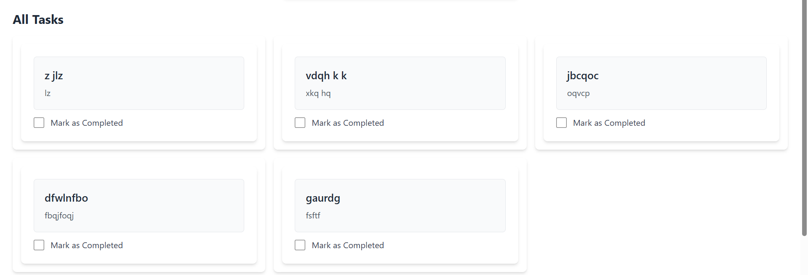
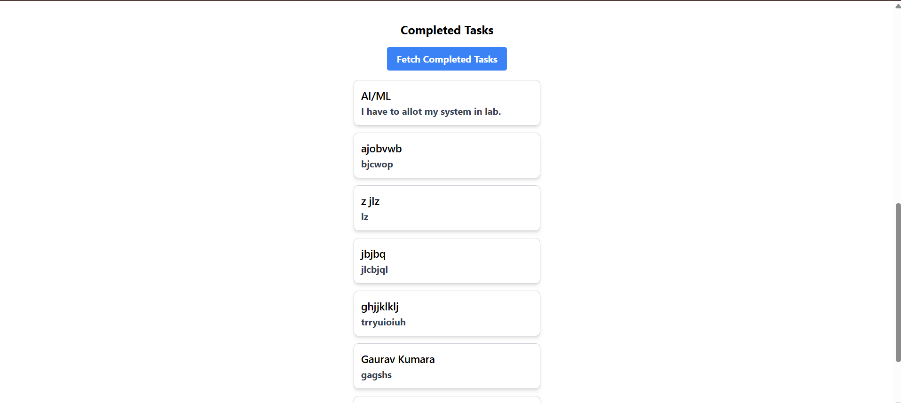

# **Task Manager (MERN Stack)**  

A simple **Task Manager App** built using **MongoDB, Express, React, and Node.js (MERN stack)**. This application allows users to **add, update, and delete tasks** while storing them in a database.

---

## **📌 Features**  
✅ Add tasks with title and description.  
✅ Mark tasks as completed.  
✅ Update and delete tasks.  
✅ Persistent storage using MongoDB.  
✅ Responsive UI built with React and TailwindCSS.  

---

## **🚀 Installation & Setup**  

### **1️⃣ Clone the Repository**  
```bash
git clone https://github.com/anirudhxmishra/task-manager.git
cd task-manager
```

### **2️⃣ Backend Setup (Node.js + Express + MongoDB)**  
1. Navigate to the backend folder:  
   ```bash
   cd backend
   ```
2. Install dependencies:  
   ```bash
   npm install
   ```
3. Create a **.env** file and add the following:  
   ```
   PORT=3000
   MONGO_URI=your_mongodb_connection_string
   ```
4. Start the backend server:  
   ```bash
   npm start
   ```
   The server will run on **http://localhost:3000**.

---

### **3️⃣ Frontend Setup (React + TailwindCSS)**  
1. Open a new terminal and navigate to the frontend folder:  
   ```bash
   cd frontend
   ```
2. Install dependencies:  
   ```bash
   npm install
   ```
3. Start the React app:  
   ```bash
   npm start
   ```
   The app will be available at **http://localhost:5173**.

---

## **🛠️ API Documentation**  

### **📍 Base URL:**  
```
http://localhost:3000/api
```

### **1️⃣ Get All Tasks**  
**Endpoint:**  
```
GET /tasks
```
**Response:**  
```json
[
  {
    "_id": "65f29a2b8c1b64a98eabc123",
    "title": "Complete Homework",
    "description": "Math and Science",
    "completed": false,
    "createdAt": "2024-03-01T12:00:00Z",
    "updatedAt": "2024-03-01T12:00:00Z"
  }
]
```

---

### **2️⃣ Create a Task**  
**Endpoint:**  
```
POST /tasks
```
**Request Body:**  
```json
{
  "title": "Read a Book",
  "description": "Read 20 pages of a novel",
  "completed": false
}
```
**Response:**  
```json
{
  "_id": "65f29a2b8c1b64a98eabc456",
  "title": "Read a Book",
  "description": "Read 20 pages of a novel",
  "completed": false,
  "createdAt": "2024-03-01T12:10:00Z",
  "updatedAt": "2024-03-01T12:10:00Z"
}
```

---

### **3️⃣ Update a Task**  
**Endpoint:**  
```
PUT /tasks/:id
```
**Request Body:**  
```json
{
  "completed": true
}
```
**Response:**  
```json
{
  "_id": "65f29a2b8c1b64a98eabc456",
  "title": "Read a Book",
  "description": "Read 20 pages of a novel",
  "completed": true,
  "createdAt": "2024-03-01T12:10:00Z",
  "updatedAt": "2024-03-01T12:15:00Z"
}
```

---

### **4️⃣ Delete a Task**  
**Endpoint:**  
```
DELETE /tasks/:id
```
**Response:**  
```json
{
  "message": "Task deleted successfully"
}
```

---

## **🔬 Testing the API**  

You can test the API using **Postman** or any API testing tool.

### **📌 Using Postman**  
1. Open Postman and enter **http://localhost:3000/api/tasks**.  
2. Select the request type (**GET, POST, PUT, DELETE**).  
3. If sending data (for POST/PUT), go to the **Body** tab and select **raw → JSON**.  
4. Click **Send** to test the request.  

---

## **🖼️ UI Screenshots**  

### **🏠 Home Page**
  

### **✅ Adding a Task**
  

### **🗑️ Completed Task**
  

---

## **📜 License**  
This project is licensed under the MIT License.  

---

## **📩 Contact**  
📧 Email: [anirudhmishra112233@gmail.com](mailto:anirudhmishra112233@gmail.com)  
🔗 GitHub: [github.com/anirudhxmishra](https://github.com/anirudhxmishra)  

---

